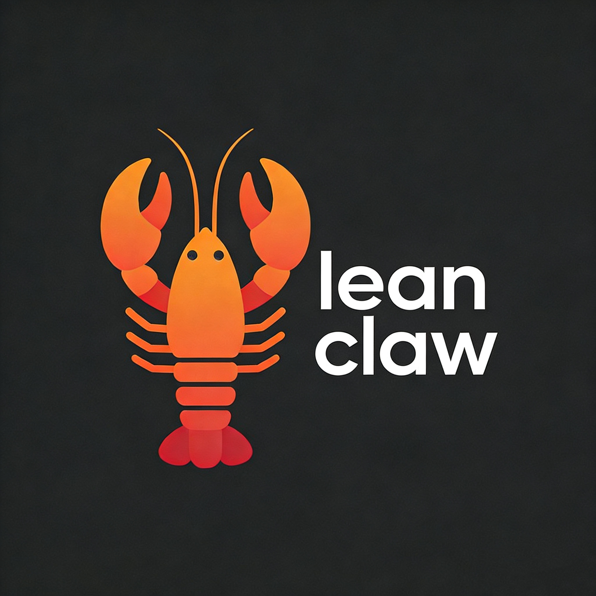

# LeanClaw

[](LICENSE)
[](https://www.espressif.com/)
[]()
[]()

**轻量级嵌入式 AI Agent 框架**



---

## 📖 项目描述

**LeanClaw** 是一个专为嵌入式系统设计的轻量级 AI Agent 调度框架。针对嵌入式环境资源受限的特点，对 Agent 的复杂能力进行了优化和裁剪，使其能够更轻便地部署在嵌入式系统上。

### ✨ 核心特性

- 🎯 **轻量级设计** - 最小仅需 4KB 线程栈 + 1.5KB 提示词空间
- 🔌 **快速接入** - 提供函数注册接口，快速定义 Skill 和执行逻辑
- 📦 **模块化架构** - 支持多 Agent、多 Channel 实例化
- 🔄 **灵活扩展** - Skill 模块可通过函数接口快速添加
- 💾 **低内存占用** - 适用于 ESP32 等资源受限的嵌入式平台

---

## 🏗️ 系统架构

### 1.1 模块详情

| 模块 | 状态 | 描述 |
|------|------|------|
| **LLM Manager** | ✅ | 支持 DeepSeek、Qwen、ChatGPT |
| **Prompt Manager** | ✅ | 支持硬件调用提示词模板 |
| **Planner** | ✅ | 任务规划（暂不支持打断） |
| **Executor** | ✅ | 函数回调注册，通过 ID 执行 Tool |
| **Skill Registry** | ✅ | 函数方式添加 Skill |
| **Channel** | ✅ | 支持 CLI、飞书 |
| **Tool** | ✅ | 内置线程创建、定时任务、日期任务等功能 |
| **Gateway** | :x: |  |
| **Router** | :x: |  |
| **Memory Manager** | :x: |  |

### 1.2 硬件要求

| 规格 | 要求 |
|------|------|
| **模组** | ESP32-WROOM-32D 或兼容型号 |
| **FLASH** | ≥ 4MB |
| **SRAM** | ≥ 520KB |
| **PSRAM** | 非必需 |

### 1.3 开发环境

| name    | version | commit-id                                |
| ------- | ------- | ---------------------------------------- |
| esp-idf | v5.4.1  | 4c2820d377d1375e787bcef612f0c32c1427d183 |

---

## 🚀 快速入门

### 2.1 配置 WIFI

```shell
#串口控制台输入
wifi_join "ssid" "passwd"
```

### 2.2 配置LLM

```shell
#建议使用deepseek,适配性更好
#默认使用的id和model是deepseek,可以直接配置api key即可
#终端输入
idf.menuconfig
 → Component config → Lean Agent Example Configuration
 →  LLM API Key  (配置你的api key)
 →  LLM Access Type ID (配置你接入的平台，参考lean_llm_access_type枚举)
 →  LLM Model Name (接入的模型)


```

### 2.3 添加自己的skill

```c
#添加skill描述
static const lean_skill_config example_skill[] = {
  { .id = EXAMPLE_SKILL_PRINTF_TEST, .desc = "打印hello world", .param = skill_param(""), .ret = "void" },
  { .id = EXAMPLE_SKILL_THREAD_PS, .desc = "查看所有线程的信息", .param = skill_param(""), .ret = "thread list" },
  /*按照例子添加你的*/
};

#添加exec执行,添加成功后，当agnet调用tool时，回调on_example_skill_exec，在内部添加您的实现即可
```

### 2.4 通过CLI对话

```shell
#串口控制台输入
chat "set gpio 21 level high"
```

### 2.5 通过飞书机器人对话

```shell
#在飞书平台上创建机器人后，获取对应参数配置
#终端输入
idf.menuconfig
 → Component config → Lean Agent Example Configuration
 →  Feishu App ID
 →  Feishu App Secret 
```

------

