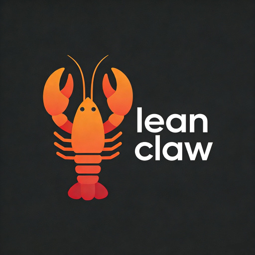

# LeanClaw

[](LICENSE)
[](https://www.espressif.com/)
[]()
[]()

**Lightweight Embedded AI Agent Framework**



---

## 📖 Description

**LeanClaw** is a lightweight AI Agent scheduling framework designed specifically for embedded systems. Considering the resource-constrained nature of embedded environments, it optimizes and trims the complex capabilities of traditional AI agents, enabling lightweight deployment on embedded platforms.

### ✨ Key Features

- 🎯 **Lightweight Design** – Minimum requirements: 4KB thread stack + 1.5KB prompt space
- 🔌 **Quick Integration** – Provides function registration interfaces to quickly define Skills and execution logic
- 📦 **Modular Architecture** – Supports multiple Agent and Channel instances
- 🔄 **Flexible Extension** – Skill modules can be easily added via function interfaces
- 💾 **Low Memory Footprint** – Suitable for resource-constrained embedded platforms like ESP32

---

## 🏗️ System Architecture

### 1.1 Module Details

| Module | Status | Description |
|--------|--------|-------------|
| **LLM Manager** | ✅ | Supports DeepSeek, Qwen, ChatGPT |
| **Prompt Manager** | ✅ | Supports hardware-callable prompt templates |
| **Planner** | ✅ | Task planning (interruption not supported yet) |
| **Executor** | ✅ | Function callback registration, executes Tools by ID |
| **Skill Registry** | ✅ | Adds Skills via functions |
| **Channel** | ✅ | Supports CLI, Feishu |
| **Tool** | ✅ | Built-in thread creation, scheduled tasks, date tasks, etc. |
| **Gateway** | ❌ | |
| **Router** | ❌ | |
| **Memory Manager** | ❌ | |

### 1.2 Hardware Requirements

| Specification | Requirement |
|---------------|-------------|
| **Module** | ESP32-WROOM-32D or compatible model |
| **FLASH** | ≥ 4MB |
| **SRAM** | ≥ 520KB |
| **PSRAM** | Not required |

### 1.3 Development Environment

| Name     | Version | Commit ID                                   |
|----------|---------|---------------------------------------------|
| esp-idf  | v5.4.1  | 4c2820d377d1375e787bcef612f0c32c1427d183    |

---

## 🚀 Quick Start

### 2.1 Configure WiFi

```shell
# Enter in serial console
wifi_join "ssid" "passwd"
```

### 2.2 Configure LLM

```shell
# DeepSeek is recommended for better compatibility
# Default ID and model use DeepSeek; simply configure the API key
# Enter in terminal
idf.menuconfig
 → Component config → Lean Agent Example Configuration
 →  LLM API Key  (configure your api key)
 →  LLM Access Type ID (select your platform, refer to lean_llm_access_type enum)
 →  LLM Model Name (specify the model)
```

### 2.3 Add Your Own Skill

```c
# Add skill description
static const lean_skill_config example_skill[] = {
  { .id = EXAMPLE_SKILL_PRINTF_TEST, .desc = "Print hello world", .param = skill_param(""), .ret = "void" },
  { .id = EXAMPLE_SKILL_THREAD_PS, .desc = "Display all thread information", .param = skill_param(""), .ret = "thread list" },
  /* Add yours following the example */
};

# Add execution logic. After successful addition, when the agent calls a tool, it will callback on_example_skill_exec.
# Implement your logic inside this function.
```

### 2.4 Chat via CLI

```shell
# Enter in serial console
chat "set gpio 21 level high"
```

### 2.5 Chat via Feishu Bot

```shell
# Create a bot on the Feishu platform and obtain the corresponding parameters
# Enter in terminal
idf.menuconfig
 → Component config → Lean Agent Example Configuration
 →  Feishu App ID
 →  Feishu App Secret
```

------

